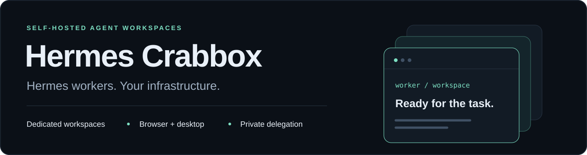
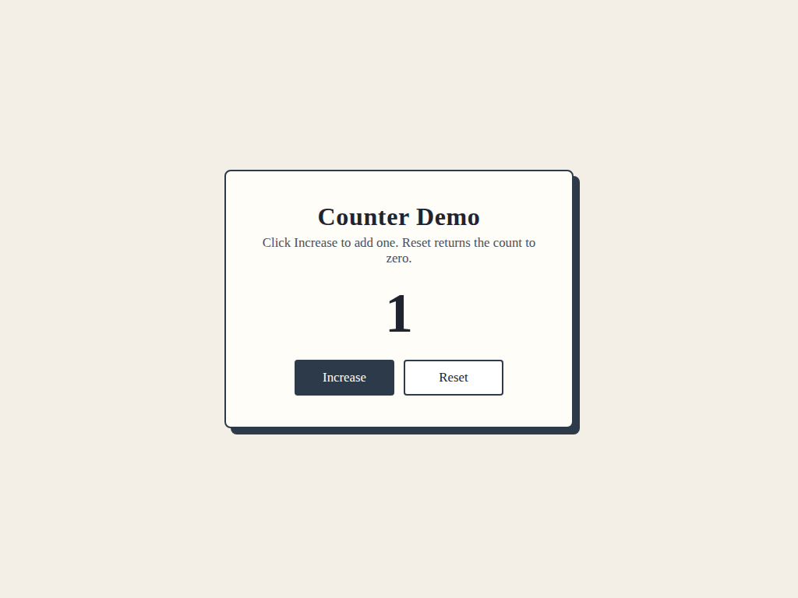
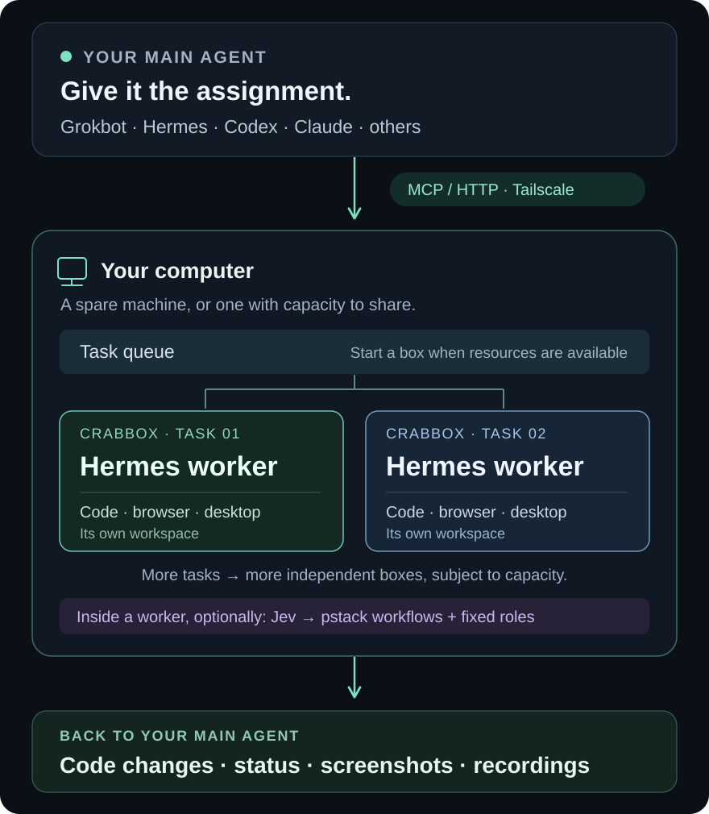

<p align="center">
  
</p>

<p align="center">
  <a href="LICENSE"></a>
  <a href="docs/QUICKSTART.md"></a>
  <a href="docs/STATUS.md"></a>
  <a href="BUILDING.md"></a>
</p>

<p align="center">
  <strong>Delegate coding work. Give every task its own workspace, browser, and desktop.</strong><br>
  Self-hosted Hermes agents, powered by Crabbox, accessible over your private Tailscale network.
</p>

<p align="center">
  <a href="docs/QUICKSTART.md"></a>
  <a href="docs/HOST-INSTALL.md"></a>
</p>

<p align="center">
  <a href="docs/AGENT-SETUP.md"><strong>Agent setup</strong></a> ·
  <a href="docs/README.md">Documentation</a> ·
  <a href="https://github.com/thomasbek3/hermes-crabbox/releases/tag/v0.1.0-preview.2">Downloads</a> ·
  <a href="docs/ARCHITECTURE.md">How it works</a> ·
  <a href="THIRD_PARTY_NOTICES.md">Credits</a>
</p>

---

## Cloud-agent workflow. Your own computer.

An alternative for people who want the delegated coding workflow of **Devin or
Cursor Cloud Agents**, using hardware they already own. Run independent container
dev boxes on a spare computer—or a machine with enough available RAM—while your
main agent hands off tasks and collects the results.

The worker environments run on your hardware. The configured LLMs can still use
external model APIs or subscriptions; this does not make inference offline or
remove provider costs. The aim is a similar delegation workflow, not feature
parity with those services. [Hardware and current limits](docs/STATUS.md#resources).

## What it does

**Parent agents such as Grokbot, Hermes, Codex, Claude, or any agent that supports
MCP or HTTP can delegate coding tasks to Hermes Crabbox.** The parent submits an
assignment; a Hermes worker runs it in a dedicated Crabbox container with its
own workspace, Chromium browser, and optional graphical desktop.

Check progress, retrieve code and screenshots, send follow-ups, and prepare a PR
from the calling agent. Tasks keep running independently of the parent's
connection. Compatibility depends on the caller's network and authentication
support; this is not a claim that every named client has been tested.

| You provide | Hermes Crabbox provides | You get back |
| --- | --- | --- |
| A task, source snapshot, and acceptance criteria | A queued Hermes worker in a separate task container | Status, events, and result files |
| A browser or UI assignment | Chromium, desktop access, and evidence skills | Screenshots and recordings for review |
| A follow-up on an existing task | The saved workspace and native session | Continued work without starting from scratch |

<details>
<summary><strong>See real browser evidence from a worker task</strong></summary>

<p align="center">
  
</p>

An actual screenshot from the synthetic Counter Demo task, captured after
clicking **Increase**. This is an example of the evidence a worker returns for
review. [Screenshots, recordings, and PR evidence →](docs/PR-EVIDENCE.md)

</details>

## Choose your setup path

| What you want to do | Start here |
| --- | --- |
| Give tasks to an existing worker computer | [Connect an agent](docs/QUICKSTART.md) — requires network access and a caller credential. |
| Run workers on your own spare computer | [Set up a worker computer](docs/HOST-INSTALL.md) — Linux host preflight and explicit installation. |

## Let your agent set it up

Point your agent at [AGENTS.md](AGENTS.md), or give it this prompt:

> Read this repository's AGENTS.md and setup guide. Install Hermes Crabbox on my
> chosen worker computer and connect the agent I'm using now. Inspect both
> machines, preserve existing configuration, keep secrets out of chat, and
> report what actually works.

[Agent setup guide →](docs/AGENT-SETUP.md) · [Platform support →](docs/HOST-INSTALL.md#platform-support)

## Connect your agent

<p>
  <a href="docs/QUICKSTART.md#add-mcp-or-keep-using-http"></a>
  <a href="https://github.com/thomasbek3/hermes-crabbox/releases/download/v0.1.0-preview.2/omarchy-cloud-delegate.zip"></a>
</p>

> **Before connecting:** the machine running the agent's tools needs Tailscale
> access to your worker host and a dedicated service credential.
> The skill installer generates MCP configuration for the server you choose.
> Source and skill downloads are public. No token is embedded in a button,
> example, or skill bundle.

### Codex: one command to register MCP

Make `OMARCHY_CLOUD_TOKEN` available to the Codex process through your secret
manager, then run:

```sh
codex mcp add hermes-crabbox \
  --url https://worker.example.ts.net/mcp \
  --bearer-token-env-var OMARCHY_CLOUD_TOKEN
```

### Hermes: install the delegation skill

Replace the example origin with the HTTPS origin from your host setup receipt:

```sh
git clone https://github.com/thomasbek3/hermes-crabbox.git
cd hermes-crabbox
python3 scripts/install-delegation-skill.py --agent hermes \
  --server https://worker.example.ts.net --json
```

The installer copies the skill and HTTP caller to `~/.hermes/skills/`, preserves
existing modified installations, and does not touch credentials or start a job.
Use `--agent codex` for `~/.agents/skills/`, or `--skills-dir PATH` for a custom
agent/profile skills directory.

**Other agents:** use the [MCP connection guide](docs/QUICKSTART.md#add-mcp-or-keep-using-http)
or the included [Python HTTP client](docs/QUICKSTART.md#add-mcp-or-keep-using-http).
Cursor users get a server-specific `cursor.mcp.json` in the installed skill.
Merge it into the selected profile, preserving existing servers.

### Give it a first assignment

After connecting, ask your agent:

> Read `get_delegation_guide`. Delegate the task in `examples/task.md` to a Hermes
> worker, supplying the specified repository snapshot. Save the task ID, check
> progress when I ask, and return the resulting changes and evidence. Do not
> merge or deploy.

[Write a useful assignment →](examples/task.md)

## How it works

<p align="center">
  
</p>

Hermes starts **inside the task container first**. In the optional pstack profile,
that running agent can ask Jev to choose an allowed workflow and invoke roles
with predefined models. Temporary role sessions share the task's workspace;
they are not new containers for every role.

[Architecture and lifecycle →](docs/ARCHITECTURE.md)

## Built for delegated work

- **One task, one environment.** Separate containers and workspaces, with queueing
  and resource admission on the execution host.
- **Browser and desktop included.** Chromium for web work; XFCE/VNC for tasks
  you want to watch. [Desktop guide](docs/DESKTOP.md).
- **Evidence with the result.** Skills for screenshots and recordings, plus a
  parent-side PR evidence publisher. [Evidence guide](docs/PR-EVIDENCE.md).
- **Persistent worker instructions.** Every supported worker profile loads the
  cloud-worker [SOUL.md](integrations/hermes-pr-evidence/SOUL.md), including repository
  contribution rules and honest completion reporting.
- **Optional model routing.** Jev selects a workflow; pstack policy fixes the
  model and effort for each role. [Routing guide](docs/CRABBOX-PSTACK.md).
- **Private access.** Tailscale connectivity, caller-scoped credentials, and
  owner-isolated tasks. [Access and security](SECURITY.md).

## Project status

**Preview.** Separate [host installation](docs/HOST-INSTALL.md) and
[caller setup](docs/QUICKSTART.md) paths support agent-driven onboarding.
The host installer targets Linux x86_64 with systemd and Docker Engine.
Provider and Tailscale logins remain owner-controlled. See the
[verification status](docs/STATUS.md) before relying on a fresh deployment.

The basic worker, desktop viewing, evidence capture, and MCP have recorded
checks. The full optional multi-model workflow remains partially qualified;
see [status and known limits](docs/STATUS.md). The host installer defaults to two
concurrent tasks and permits up to eight, subject to resource admission; this
is not an eight-task load-test claim.

PR publishing uses the parent agent's authorized GitHub access. Workers do not
receive its GitHub credentials. The source is public; access to a running worker
host still requires explicit caller provisioning.

## Develop and contribute

```sh
python3 -m venv .venv
.venv/bin/pip install -e '.[test]'
```

Start with [building and deployment](BUILDING.md), [contributing](CONTRIBUTING.md),
and the [documentation index](docs/README.md). Operator scripts can change a live
host; read their documented scope before running them.

<details>
<summary><strong>Repository map</strong></summary>

| Path | Purpose |
| --- | --- |
| [`src/cloudworkbench/`](src/cloudworkbench/) | API, scheduler, persistence, runtime, results, and routing |
| [`integrations/omarchy-mcp/`](integrations/omarchy-mcp/) | MCP server, caller skill, and package builder |
| [`integrations/omarchy-cloud/`](integrations/omarchy-cloud/) | HTTP client, desktop helper, and credential refresh |
| [`integrations/hermes-cloud-pstack/`](integrations/hermes-cloud-pstack/) | Agent-invoked routing and role tools |
| [`integrations/hermes-pr-evidence/`](integrations/hermes-pr-evidence/) | SOUL, evidence skills, and attributed browser skill |
| [`deploy/`](deploy/) | Image recipes and service units |
| [`scripts/`](scripts/) · [`tests/`](tests/) | Operator tools and checks |
| [`docs/`](docs/) | Current guides and historical design records |
| [`LICENSES/`](LICENSES/) | Preserved upstream licenses and provenance |

Internal Python packages and services retain their `cloudworkbench` names.
Credentials, databases, raw reviews, and private task outputs are excluded.
Only the explicitly selected synthetic demo screenshot is included as evidence.
Historical documents can reference local evidence that is intentionally absent.

</details>

## License and acknowledgments

Original integration code is [MIT licensed](LICENSE). This project builds on
[Crabbox](https://github.com/openclaw/crabbox),
[Hermes Agent](https://github.com/NousResearch/hermes-agent),
[Lauren Tan's pstack](https://github.com/cursor/plugins/tree/main/pstack),
[its Hermes port](https://github.com/jmporchet/pstack-hermes), and
[Vercel's agent-browser](https://github.com/vercel-labs/agent-browser).
The [Hermes Jev router](https://github.com/ussyverse/hermes-jev-router) informed
the routing design.

Copied upstream material retains its own terms, including **Apache 2.0 for the
browser skill**. See [licensing scope](LICENSING.md) and
[full credits, source pins, and notices](THIRD_PARTY_NOTICES.md).

Independent integration maintained by Thomas Bekkers; not an official release
of, or endorsed by, those upstream projects.
